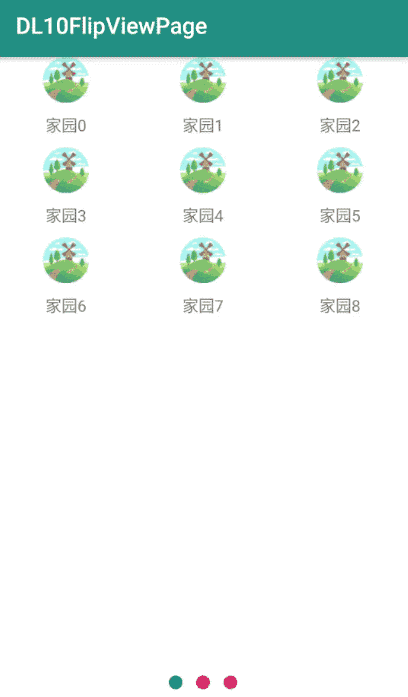

# DL10FlipViewPage
一个组合控件翻页式的GridView列表带可定制的圆形页面指示器

说明链接：

# 效果图


# 使用方法

Step 1. Add the JitPack repository to your build file 
Add it in your root build.gradle at the end of repositories:
```java
	allprojects {
		repositories {
			...
			maven { url 'https://jitpack.io' }
		}
	}
```
Step 2. Add the dependency
```java
	dependencies {
	        implementation 'com.github.D10NGYANG:DL10FlipViewPage:1.0.0'
	}
```
